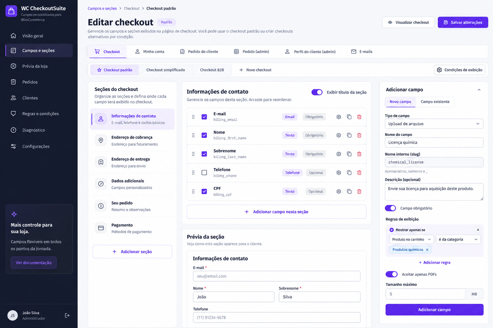
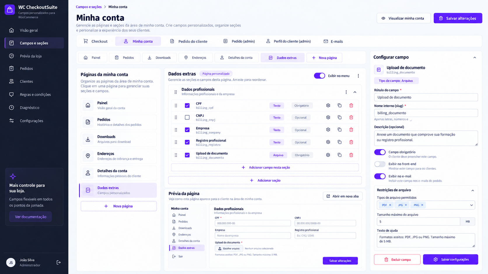
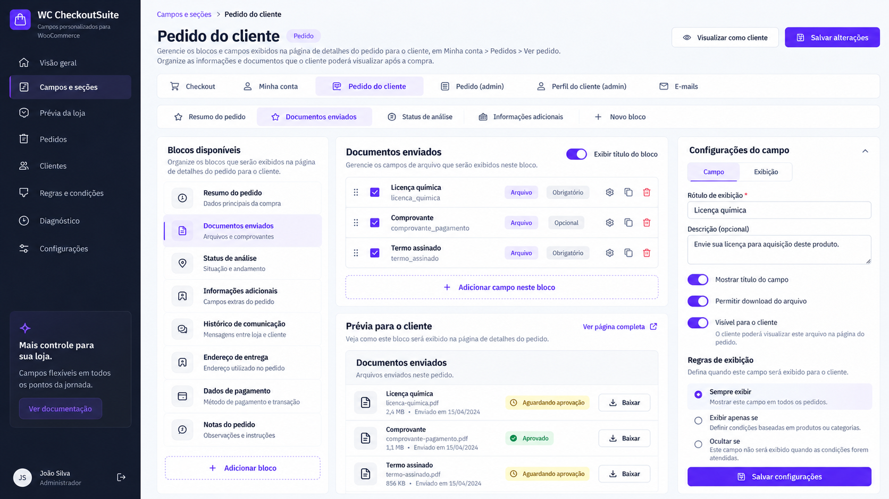
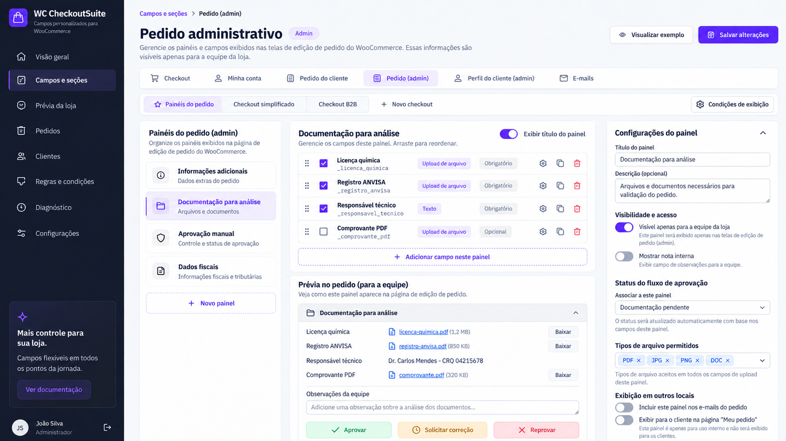
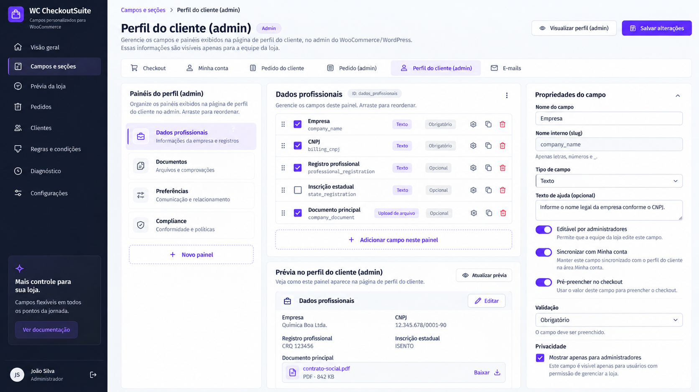
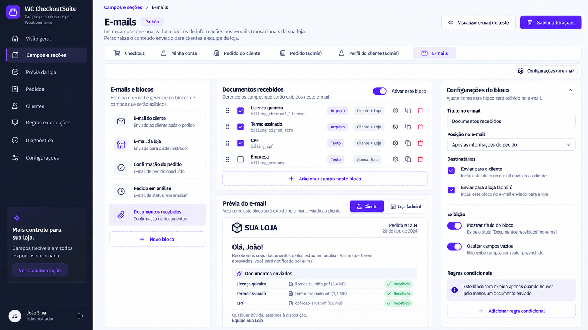
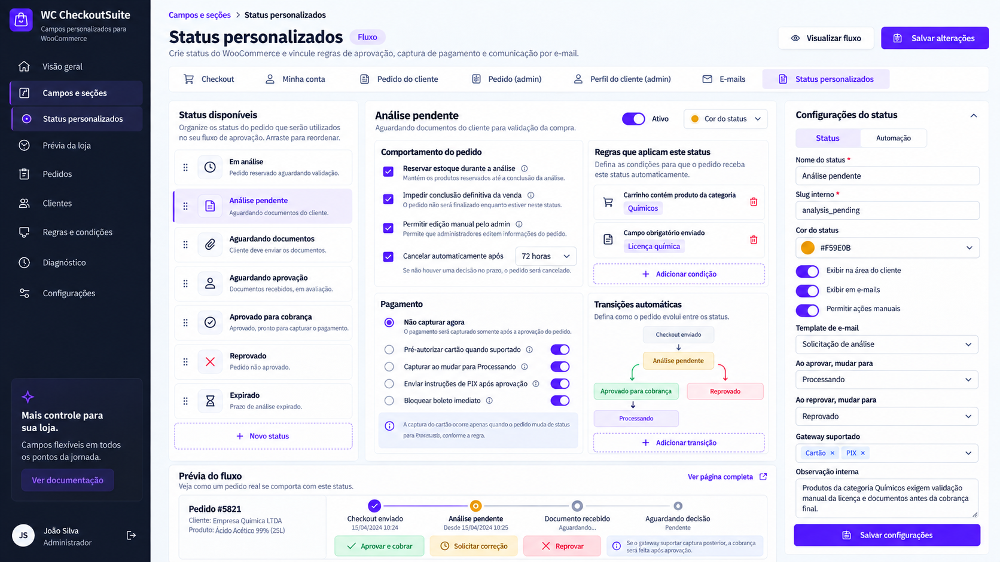
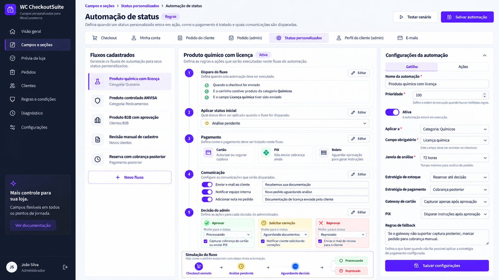

# WC CheckoutSuite — Especificação Funcional, UX, Arquitetura e Roadmap

**Versão:** 1.0  
**Data:** 2026-09-15  
**Produto:** WC CheckoutSuite  
**Objetivo:** consolidar o comportamento funcional, visual e técnico das telas e fluxos definidos para o plugin, conectando-os à base de código atual sem reescrever o que já funciona.

---

# 1. Base considerada nesta especificação

## 1.1. Código auditado

A análise de código desta especificação foi feita contra:

```text
Repository: fagworio/wc-checkout-suite
Branch: main
Commit: 58f888ae6f4cbbdd76d9fbb756faf0091ad60004
Message: test: cover admin field editor flow
```

O ambiente local pode conter trabalho ainda não commitado e, portanto, mais recente que o GitHub. Antes de iniciar qualquer refatoração, o agente deve:

1. executar `git status`;
2. comparar o `HEAD` local com `main`;
3. preservar alterações não commitadas;
4. mapear quais itens desta especificação já foram parcialmente implementados localmente.

Nenhuma conclusão desta documentação autoriza descartar trabalho local.

## 1.2. Escopo atual

Entram no produto:

- editor de campos;
- campos nativos e customizados;
- seções e containers de apresentação;
- Checkout Classic;
- Checkout Blocks;
- perfis de checkout;
- checkout customizado opcional;
- regras condicionais;
- máscaras e validações;
- uploads privados;
- Minha Conta;
- pedido do cliente;
- pedido administrativo;
- perfil administrativo do cliente;
- blocos de e-mail;
- status customizados;
- fluxos de aprovação;
- automações de status;
- integração controlada com pagamentos;
- reserva/liberação de estoque associada a workflows;
- HPOS;
- histórico e snapshots de pedido.

Fica fora desta etapa:

- Checkout Sidebar transacional;
- minicarrinho de finalização em drawer;
- substituição de gateways por implementações próprias;
- promessa genérica de compatibilidade com todo gateway existente.


## 1.3. Referências visuais obrigatórias

As imagens abaixo fazem parte desta especificação. Elas não são ilustrações opcionais: são a **base visual de implementação** das telas administrativas e devem ser analisadas junto com as regras funcionais deste documento.

A implementação deve preservar, salvo quando esta especificação determinar explicitamente outra coisa:

- hierarquia visual;
- distribuição em colunas;
- navegação lateral;
- tabs de destino;
- cards e painéis;
- espaçamento e densidade;
- uso de violeta para ação/seleção;
- estados de sucesso, atenção e destruição;
- posição das ações primárias;
- relação entre lista, conteúdo principal, prévia e painel de propriedades;
- padrão de toggles, selects, badges, botões e áreas de adição;
- comportamento responsivo derivado da mesma hierarquia.

### Regra de precedência

As imagens definem **como a experiência deve ser apresentada**.  
Este documento define **como a funcionalidade deve se comportar**.

Se houver conflito entre um texto presente em um mockup e uma regra técnica/funcional desta especificação, prevalece a regra funcional deste documento. O mockup não pode ser usado para reintroduzir comportamento tecnicamente inseguro ou que já tenha sido refinado no roadmap.

Exemplos:

```text
Mockup sugere "capturar ao mudar para Processando"
+
Especificação exige PaymentAction + capability homologada
=
implementar PaymentAction + capability homologada
```

```text
Mockup mostra uma seção/painel específico
+
Modelo final usa ContainerDefinition + FieldBinding
=
preservar a apresentação visual, mas implementar sobre o modelo final
```

### Mapa das referências

| Tela | Arquivo visual |
|---|---|
| Checkout | `wc-checkoutsuite-doc-assets/01-checkout.png` |
| Minha Conta | `wc-checkoutsuite-doc-assets/02-minha-conta.png` |
| Pedido do cliente | `wc-checkoutsuite-doc-assets/03-pedido-cliente.png` |
| Pedido administrativo | `wc-checkoutsuite-doc-assets/04-pedido-admin.png` |
| Perfil do cliente (admin) | `wc-checkoutsuite-doc-assets/05-perfil-cliente-admin.png` |
| E-mails | `wc-checkoutsuite-doc-assets/06-emails.png` |
| Status personalizados | `wc-checkoutsuite-doc-assets/07-status-personalizados.png` |
| Automação de status | `wc-checkoutsuite-doc-assets/08-automacao-status.png` |

### Critério visual de aceite

Uma tela só pode ser considerada concluída visualmente quando:

1. a estrutura principal corresponde ao mockup associado;
2. a hierarquia de informação é equivalente;
3. a ação primária está clara e no mesmo nível de destaque;
4. estados vazios, carregamento, erro e salvamento seguem o design system;
5. o painel de propriedades mostra apenas opções válidas para o contexto selecionado;
6. elementos sem funcionalidade real não aparecem como controles ativos;
7. o layout continua utilizável em resoluções menores;
8. o frontend não depende de texto hardcoded da imagem;
9. componentes são reutilizáveis entre destinos equivalentes;
10. diferenças necessárias em relação ao mockup ficam justificadas por regra funcional ou limitação real da plataforma.


---

# 2. Princípios obrigatórios do produto

## 2.1. Uma definição de campo, vários usos

Um campo não deve ser duplicado apenas porque aparece em lugares diferentes.

Exemplo:

```text
FieldDefinition: Licença química
    ↓
Checkout → Documentação
    ↓
Pedido do cliente → Documentos enviados
    ↓
Pedido admin → Documentação para análise
    ↓
E-mail → Documentos recebidos
```

A definição é única. Cada uso é um vínculo.

## 2.2. Destinos são opt-in

Criar um campo no Checkout não o exibe automaticamente:

- no pedido administrativo;
- no pedido do cliente;
- em Minha Conta;
- em e-mails;
- no perfil administrativo;
- na API;
- em fluxos de aprovação.

Cada destino depende de configuração explícita.

## 2.3. Configuração e resposta são coisas diferentes

**Configuração:** tipo, label, validação, posição, condições e vínculos.

**Resposta:** valor efetivamente preenchido pelo cliente ou equipe.

Alterar a configuração atual não pode reescrever respostas históricas de pedidos.

## 2.4. Perfil do cliente e pedido histórico são diferentes

Valor atual do cliente:

```text
Registro profissional = XYZ999
```

Snapshot do pedido antigo:

```text
Pedido #123 = ABC123
```

Editar o perfil não altera o pedido já realizado.

## 2.5. Uma única ação normal de salvamento

O fluxo normal é:

```text
Editar
→ Salvar alterações
→ confirmação
```

Não usar como etapa obrigatória:

```text
Salvar rascunho
→ Revisar publicação
→ Publicar
```

Histórico interno e revisões podem continuar existindo tecnicamente, mas não devem complicar o uso normal.

## 2.6. Erro funcional não vira warning técnico

Se uma configuração não puder funcionar no checkout/destino ativo, ela não deve ser salva como se estivesse operacional.

Exemplo impeditivo:

```text
Campo obrigatório de upload
+
renderer inexistente no checkout ativo
=
salvamento/aplicação recusado
```

Exemplo não impeditivo:

```text
largura não reproduzível exatamente no Blocks
=
warning visual
```

## 2.7. Nenhum gateway é controlado por suposição

A Suite não deve assumir que um gateway:

- suporta autorização sem captura;
- captura posteriormente;
- gera PIX depois da aprovação;
- regenera PIX;
- suporta cancelamento de autorização;
- aceita reprocessamento programático.

Essas capacidades devem ser homologadas por gateway e versão.

---

# 3. Modelo conceitual final

A interface deve usar a estrutura:

```text
Destino
  ↓
Container visual
  ↓
Binding
  ↓
FieldDefinition
```

## 3.1. FieldDefinition

Define o dado.

```text
id
integration_id
origin
type
preset
label
description
mask
normalizer
validators
settings
sensitivity
```

## 3.2. ContainerDefinition

Define onde e como um grupo aparece.

```text
id
name
destination
presentation
position
enabled
show_title
display_title
description
icon
target
settings
```

### Presentations

```text
checkout_group
my_account_endpoint
my_account_existing_page
customer_order_block
admin_order_panel
admin_customer_panel
email_block
```

## 3.3. FieldBinding

Liga um campo a um container.

```text
id
field_id
container_id
position
visible
editable
required_override
label_override
description_override
permissions
conditions
```

O mesmo campo pode possuir múltiplos bindings, inclusive mais de um no mesmo destino.

## 3.4. CheckoutProfile

Representa uma composição completa de checkout.

```text
id
name
enabled
source
priority
fallback
conditions
sections
presentation
```

`source`:

```text
woocommerce_current
duplicate_profile
minimal
```

## 3.5. RuleSet

Regras são reutilizadas por:

- campo;
- binding;
- CheckoutProfile;
- status/automação.

O formato deve continuar declarativo e validado no backend.

## 3.6. CustomerValue

Valor atual pertencente ao cliente.

## 3.7. OrderSnapshot

Valor utilizado no pedido naquele momento.

## 3.8. WorkflowDefinition

Representa automação de pedido/status/pagamento.

```text
id
name
enabled
priority
trigger
conditions
initial_status
inventory_strategy
payment_strategy
communications
transitions
fallbacks
```

---

# 4. Arquitetura de navegação administrativa

Menu principal do WC CheckoutSuite:

```text
Visão geral

Campos e seções
  ├── Checkout
  ├── Minha Conta
  ├── Pedido do cliente
  ├── Pedido (admin)
  ├── Perfil do cliente (admin)
  └── E-mails

Status e automações

Prévia da loja
Pedidos
Clientes
Regras e condições
Diagnóstico
Configurações
```

A tela `Campos e seções` mantém a navegação horizontal entre superfícies conforme os mockups.

---

# 5. Design system comum

## 5.1. Linguagem visual

Manter a identidade criada:

- sidebar azul-marinho escuro;
- workspace claro;
- violeta como cor de ação e seleção;
- cards brancos;
- bordas discretas;
- raio visual consistente;
- tipografia limpa e de alto contraste;
- hierarquia clara entre título, descrição e metadados;
- vermelho somente para ações destrutivas;
- verde para sucesso/aprovação;
- âmbar para pendência/atenção.

## 5.2. Estrutura padrão das telas

```text
Breadcrumb
Título + descrição                         ações globais

Tabs de destino

Subnavegação contextual

┌──────────────┬──────────────────────┬─────────────────────┐
│ Navegação    │ Conteúdo principal   │ Propriedades        │
│ contextual   │ e/ou prévia          │ do item selecionado │
└──────────────┴──────────────────────┴─────────────────────┘
```

## 5.3. Componentes reutilizáveis

Reutilizar/criar:

- `PageHeader`
- `SurfaceTabs`
- `ContextTabs`
- `ContainerList`
- `SortableFieldList`
- `FieldProperties`
- `ContainerProperties`
- `ConditionBuilder`
- `PreviewPanel`
- `Notice`
- `Toggle`
- `Select`
- `FieldPicker`
- `IconPicker`
- `ConfirmDialog`
- `EmptyState`
- `CapabilityBadge`
- `StatusBadge`
- `WorkflowStep`
- `FlowDiagram`

## 5.4. Estados de interface

Toda tela editável deve possuir:

### Pristine

Nenhuma alteração local.

```text
Salvar alterações = disabled
```

### Dirty

Há mudanças ainda não persistidas.

```text
● Alterações não salvas
Salvar alterações = enabled
```

### Saving

```text
Salvando...
```

Bloquear envios duplicados.

### Success

Notice padrão do WordPress:

```text
Alterações salvas com sucesso.
```

Com ação contextual, quando útil.

### Validation error

```text
Não foi possível salvar.
Corrija os campos destacados.
```

O foco deve ir ao primeiro erro.

### Network/session failure

Preservar a edição local.

```text
Não foi possível salvar as alterações.
Sua edição foi preservada.
```

### Conflict

Se outro administrador atualizou a configuração:

```text
A configuração mudou em outra sessão.
[Recarregar versão atual] [Comparar]
```

Não sobrescrever silenciosamente.

---

# 6. Tela: Checkout


## Referência visual — Checkout

A referência fixa a estrutura com navegação lateral, tabs de destino, perfis de checkout, lista de seções, editor central, painel contextual e prévia.



## 6.1. Objetivo

Permitir:

1. editar o checkout padrão existente;
2. adicionar campos ao checkout existente;
3. reordenar campos;
4. adicionar seções;
5. criar perfis alternativos de checkout;
6. definir regras que selecionam um perfil;
7. pré-visualizar o cenário;
8. ativar apresentação customizada sem recriar a engine transacional do WooCommerce.

## 6.2. Primeira entrada

A tela deve carregar o checkout real da loja.

Não começar vazia.

Exibir:

```text
Checkout padrão

Contato
Cobrança
Entrega
Pedido
...
```

e os campos nativos detectados.

Campos WooCommerce devem ser identificados como:

```text
Nativo
```

Campos da Suite:

```text
Personalizado
```

## 6.3. Perfis de checkout

Subnavegação:

```text
[ Checkout padrão ] [ Checkout digital ] [ Produtos restritos ] [+ Novo checkout]
```

### Checkout padrão

- existe sempre;
- pode ser fallback;
- começa a partir dos campos WooCommerce atuais;
- não deve ser excluído se for o fallback único.

### Criar novo perfil

Modal:

```text
Novo checkout

Nome
[ Checkout digital ]

Começar com:
( ) Checkout atual do WooCommerce
( ) Duplicar outro checkout
( ) Checkout mínimo

[Cancelar] [Criar checkout]
```

### Checkout mínimo

Não significa ignorar obrigações técnicas.

Antes de salvar, verificar:

- gateway;
- impostos;
- entrega;
- dados requeridos pelas integrações;
- regras legais configuradas.

## 6.4. Seções do checkout

Painel esquerdo:

```text
Informações de contato
Endereço de cobrança
Endereço de entrega
Dados adicionais
Seu pedido
Documentação
Pagamento
+ Adicionar seção
```

### Nova seção

```text
Nome
Posição
Exibir título no checkout [OFF]
Descrição opcional
```

`show_title` default: **false**.

O nome permanece no admin mesmo com título oculto no frontend.

## 6.5. Lista de campos

Centro:

- drag handle;
- ativo;
- label;
- chave;
- tipo;
- required;
- ações;
- duplicar para campo customizado;
- mover/reordenar.

Ações:

```text
Adicionar campo nesta seção
Usar campo existente
```

## 6.6. Adicionar campo

Painel lateral:

```text
Novo campo | Campo existente
```

Campos principais:

- tipo;
- label;
- ID sugerido;
- descrição;
- obrigatório;
- configurações do tipo;
- regras;
- validações;
- armazenamento;
- bindings posteriores opcionais.

## 6.7. Alterar campo nativo

A edição deve modificar o campo real nos limites suportados pela integração.

Não criar uma cópia silenciosa.

Se uma propriedade não puder ser alterada no Blocks, informar imediatamente.

## 6.8. Condições do campo

Exemplo:

```text
Mostrar somente se:

Produto no carrinho
pertence à categoria
Produtos químicos
```

Fontes previstas:

- produto;
- categoria;
- tag;
- virtual/downloadable;
- quantidade;
- subtotal;
- país;
- estado;
- método de envio;
- método de pagamento;
- usuário;
- role;
- outro campo.

Validação final ocorre no backend.

## 6.9. Regra do perfil

Diferente da regra do campo.

```text
Perfil "Produtos químicos"

Usar quando:
Carrinho contém produto da categoria "Químicos"
```

Prioridade:

```text
1. Produtos restritos
2. Produtos digitais
3. Checkout padrão — fallback
```

Se mais de um perfil puder casar, mostrar aviso de sobreposição.

## 6.10. Prévia

Permitir selecionar:

```text
Perfil
Cenário
Produto
Estado de regras
Desktop / tablet / mobile
```

A prévia é administrativa.

Deve existir botão separado:

```text
Abrir checkout real
```

## 6.11. Backend

Reutilizar:

- `FieldDefinition`;
- registries de tipos;
- `ConditionTree`;
- Classic adapter;
- Blocks adapter;
- Store API;
- upload atual;
- validation pipeline;
- schema repository.

Adicionar:

- `CheckoutProfileDefinition`;
- `CheckoutProfileResolver`;
- adaptação dos adapters para receber perfil resolvido;
- validação de conflito/fallback.

## 6.12. Teste de usuário

### Cenário A — licença química

Usuário deve:

1. abrir Checkout padrão;
2. criar seção `Documentação`;
3. adicionar File Upload `Licença química`;
4. aceitar apenas PDF;
5. marcar obrigatório;
6. criar condição categoria = Químicos;
7. salvar;
8. abrir checkout real com produto químico;
9. confirmar presença;
10. trocar para produto comum e confirmar ausência.

### Sucesso

- usuário entende onde adicionar o campo;
- não precisa configurar outro destino para coletá-lo;
- campo aparece somente no cenário correto;
- checkout bloqueia compra sem documento quando aplicável.

### Confusões a observar

- diferença entre perfil e seção;
- diferença entre condição do perfil e do campo;
- percepção de `show_title`;
- entendimento de campo nativo versus customizado.

---

# 7. Tela: Minha Conta


## Referência visual — Minha Conta

A referência fixa a separação entre páginas da conta, conteúdo configurável, prévia e propriedades do campo.



## 7.1. Objetivo

Permitir criar formulários persistentes do cliente:

- em nova página do menu;
- dentro de página existente;
- sem depender de pedido.

## 7.2. Navegação

Mostrar páginas atuais:

```text
Painel
Pedidos
Downloads
Endereços
Detalhes da conta

Páginas personalizadas
Dados extras
Documentação profissional

+ Nova página
```

## 7.3. Nova página

Configuração:

```text
Nome no menu
Ícone
Posição no menu
Exibir título no conteúdo
Título exibido
Slug — Avançado
```

O slug é gerado automaticamente e precisa ser único.

## 7.4. Página existente

Permitir criar uma seção dentro de superfície homologada:

```text
Página:
Detalhes da conta

Seção:
Dados profissionais
```

A implementação precisa definir explicitamente quais páginas nativas podem receber conteúdo com segurança.

## 7.5. Campos

Aqui é permitido:

```text
Adicionar novo campo
Usar campo existente
```

Diferente da implementação atual do GitHub, não bloquear criação simplesmente porque a área não é Checkout.

## 7.6. Persistência

Valores dessa superfície pertencem ao cliente.

Não armazenar como order meta.

## 7.7. Prefill no checkout

Opcional por binding:

```text
Pré-preencher no Checkout [ON/OFF]
Atualizar perfil pelo Checkout [ON/OFF]
```

São duas decisões diferentes.

## 7.8. Upload

Deve funcionar sem pedido.

Fluxo:

```text
upload temporário privado
→ validar
→ salvar formulário
→ tornar vínculo persistente do cliente
```

Download posterior deve autorizar pelo dono do perfil.

## 7.9. Frontend

Nova página precisa:

- aparecer no menu;
- abrir sem pedido;
- mostrar formulário mesmo quando vazio;
- permitir salvar;
- usar nonce/capability;
- validar server-side;
- mostrar erros junto aos campos;
- manter upload privado.

## 7.10. Backend

Novo módulo sugerido:

```text
MyAccountSections
AccountSectionForm
CustomerFieldsService
AccountSectionController
CustomerUploadOwnership
```

Não colocar esse comportamento em `CustomerOrderFields`, que lida com snapshots de pedidos.

## 7.11. Teste de usuário

1. criar `Dados extras`;
2. escolher ícone;
3. adicionar `Registro profissional`;
4. adicionar arquivo;
5. salvar;
6. entrar como cliente sem pedidos;
7. localizar a nova página;
8. preencher;
9. salvar;
10. sair e entrar de novo;
11. verificar persistência.

### Sucesso

- menu criado corretamente;
- nenhuma compra necessária;
- valores persistentes;
- outro usuário não acessa os dados.

---

# 8. Tela: Pedido do cliente


## Referência visual — Pedido do cliente

A referência fixa a organização por blocos, prévia do que o cliente verá e propriedades de exibição/download.



## 8.1. Objetivo

Configurar o que o comprador pode visualizar em:

```text
Minha Conta → Pedidos → Ver pedido
```

Não é uma página global de perfil.

## 8.2. Blocos

Exemplos:

```text
Resumo do pedido
Documentos enviados
Status de análise
Informações adicionais
Histórico de comunicação
```

Botão:

```text
+ Novo bloco
```

## 8.3. Campos

A ação principal é:

```text
Usar campo existente
```

porque a tela normalmente apresenta snapshots do pedido.

Um novo campo só deve ser permitido se existir um caso de edição pós-compra explicitamente suportado.

## 8.4. Configurações por binding

- título de exibição;
- posição;
- visível para cliente;
- download permitido;
- mostrar metadata do arquivo;
- permitir reenvio quando workflow autorizar;
- condição de visibilidade.

## 8.5. Arquivo

Nunca usar URL pública direta.

Botão `Baixar` passa pela política de download.

## 8.6. Status de aprovação

Se workflow estiver configurado:

```text
Aguardando análise
Correção solicitada
Aprovado
Reprovado
```

Não mostrar estado interno não autorizado.

## 8.7. Backend

Reutilizar:

- `CustomerOrderFields`;
- `OrderFieldsService`;
- `AreaProjection`;
- `DownloadPolicy`.

Adaptar:

- `AreaProjection` para bindings múltiplos;
- blocos definidos por ContainerDefinition;
- reenvio de arquivo autorizado pelo workflow.

## 8.8. Teste de usuário

1. pedido com `Licença química`;
2. cliente abre o pedido;
3. vê o arquivo;
4. baixa;
5. vê `Aguardando análise`;
6. equipe solicita correção;
7. cliente vê motivo;
8. reenvia nova versão.

### Sucesso

- somente o dono acessa;
- versão antiga preservada;
- nova versão indicada como atual;
- status compreensível.

---

# 9. Tela: Pedido administrativo


## Referência visual — Pedido administrativo

A referência fixa a organização por painéis, área de análise documental, ações de aprovação e configuração contextual.



## 9.1. Objetivo

Configurar painéis exibidos na edição do pedido e fornecer ferramentas para processamento.

## 9.2. Painéis

Exemplos:

```text
Informações adicionais
Documentação para análise
Aprovação manual
Dados fiscais
```

Botão:

```text
+ Novo painel
```

## 9.3. Configuração do painel

- nome;
- descrição;
- posição;
- exibir título;
- visibilidade para equipe;
- edição autorizada;
- nota interna;
- workflow associado.

## 9.4. Campos

Pode:

- usar campo existente;
- permitir edição administrativa quando o storage permitir;
- exibir arquivo;
- baixar arquivo;
- mostrar versão;
- mostrar origem;
- mostrar snapshot.

## 9.5. Aprovação

Se painel associado a workflow:

```text
[Aprovar]
[Solicitar correção]
[Reprovar]
```

Cada ação:

1. verifica capability;
2. verifica versão atual do documento;
3. usa idempotency guard;
4. registra decisão;
5. adiciona order note adequada;
6. executa transição configurada;
7. dispara comunicação uma vez.

## 9.6. Backend

Reutilizar fortemente:

- `OrderFieldsPanel`;
- WC_Order CRUD;
- HPOS support;
- `OrderFieldsService`;
- `ValueProcessor`;
- uploads.

Adaptar `OrderFieldsPanel` para múltiplos painéis, em vez de um bloco único.

## 9.7. Teste de usuário

1. abrir pedido HPOS;
2. encontrar `Documentação para análise`;
3. visualizar licença;
4. aprovar;
5. confirmar status;
6. confirmar payment action somente se workflow autorizar;
7. confirmar nota e auditoria;
8. repetir clique e verificar idempotência.

---

# 10. Tela: Perfil do cliente (admin)


## Referência visual — Perfil do cliente no admin

A referência fixa a separação entre painéis do perfil, dados atuais do cliente e propriedades de sincronização/privacidade.



## 10.1. Objetivo

Permitir à equipe visualizar/editar dados atuais do cliente.

Não confundir com:

- Minha Conta;
- snapshot do pedido.

## 10.2. Destino separado

Novo key:

```text
admin_customer_profile
```

Minha Conta:

```text
customer_account
```

O legado:

```text
customer_profile
```

é ambíguo e exige migração assistida.

## 10.3. Painéis

Exemplos:

```text
Dados profissionais
Documentos
Preferências
Compliance
```

## 10.4. Campo

Configurações:

- editável por administradores;
- somente leitura;
- sincronizar com Minha Conta;
- pré-preencher no Checkout;
- privacidade.

Sincronizar precisa indicar direção:

```text
Minha Conta ↔ perfil
perfil → checkout
checkout → perfil
```

Não assumir sincronização bidirecional.

## 10.5. Backend

Precisa de storage persistente de cliente e API própria.

Não editar order snapshots.

## 10.6. Teste de usuário

1. cliente possui CNPJ;
2. admin altera CNPJ atual;
3. Minha Conta reflete se sincronização permitida;
4. pedido antigo mantém CNPJ original;
5. novo checkout recebe novo valor se prefill habilitado.

---

# 11. Tela: E-mails


## Referência visual — E-mails

A referência fixa a seleção do contexto de e-mail, edição de blocos, preview e propriedades de audiência/exibição.



## 11.1. Objetivo

Configurar blocos de campos e informações em e-mails transacionais.

## 11.2. Navegação

Selecionar contexto:

```text
E-mail do cliente
E-mail da loja
Pedido concluído
Pedido em análise
Documentos recebidos
...
```

A lista deve representar templates/eventos reais suportados, não apenas labels visuais.

## 11.3. Novo bloco

Configurações:

- título;
- posição;
- destinatário;
- show_title;
- ocultar campos vazios;
- condição;
- campos existentes;
- formato HTML/text.

## 11.4. Arquivos

Default:

```text
não anexar
```

Opções seguras:

- mostrar metadata;
- link protegido;
- nada.

Anexo precisa ser recurso explicitamente futuro e sujeito a política adicional.

## 11.5. Backend

Reutilizar:

- `OrderEmailFields`;
- `AreaProjection`;
- HTML/text split;
- file permissions.

Adaptar para ContainerDefinition/Binding.

## 11.6. Teste de usuário

1. criar bloco `Documentos recebidos`;
2. incluir Licença;
3. habilitar para cliente;
4. enviar e-mail de teste/pedido;
5. verificar HTML;
6. verificar plain text;
7. garantir que arquivo não está anexado;
8. garantir que link protegido só aparece quando permitido.

---

# 12. Tela: Status personalizados


## Referência visual — Status personalizados

A referência fixa o editor de estados, comportamento, condições, transições e preview do fluxo. As regras financeiras deste documento prevalecem sobre qualquer simplificação mostrada no mockup.



## 12.1. Objetivo

Gerenciar estados de pedido utilizados pelos workflows da Suite.

Status e automação devem ser conceitos separados:

```text
Status = estado
Automação = quando entrar/sair desse estado e o que fazer
```

## 12.2. Lista

Exemplos:

```text
Análise pendente
Aguardando documentos
Aguardando aprovação
Aprovado para cobrança
Reprovado
Expirado
```

## 12.3. Configuração

- nome;
- slug interno estável;
- cor;
- ativo;
- mostrar ao cliente;
- mostrar em e-mails;
- permitir ações manuais;
- label para cliente;
- descrição;
- políticas associadas.

## 12.4. Regra financeira obrigatória

Um status customizado **não é por si só um comando de cobrança**.

Não implementar:

```text
status mudou para Processing
→ cobrar cartão automaticamente
```

Implementar:

```text
transição de workflow
→ PaymentAction autorizada
→ gateway capability
→ executar
→ payment_complete
→ WooCommerce decide Processing/Completed
```

Isso evita cobrança acidental por alteração manual/importação/webhook.

## 12.5. Status de pré-pagamento

`Análise pendente` deve permanecer como **não pago**.

Não adicionar esse status à lista de paid statuses.

## 12.6. Registro WooCommerce

Registrar somente status completos, estáveis e habilitados.

IDs permanentes não devem ser derivados de label mutável de forma que renomear crie outro estado.

## 12.7. Teste de usuário

1. criar `Análise pendente`;
2. mostrar ao cliente;
3. salvar;
4. criar pedido teste;
5. aplicar status;
6. confirmar que Woo não o considera pago;
7. renomear label;
8. confirmar que pedidos continuam no mesmo status interno.

---

# 13. Tela: Automação de status


## Referência visual — Automação de status

A referência fixa o fluxo em etapas, lista de automações, painel de configuração e simulação. A execução real deve obedecer às capabilities homologadas e às regras de idempotência.



## 13.1. Objetivo

Criar workflows que coordenam:

- gatilho;
- condições;
- status;
- aprovação;
- comunicação;
- estoque;
- pagamento;
- expiração;
- fallback.

## 13.2. Editor em passos

### Passo 1 — Disparo

Exemplo:

```text
Checkout enviado
E carrinho contém categoria Químicos
E campo Licença química foi enviado
```

### Passo 2 — Status inicial

```text
Análise pendente
```

### Passo 3 — Estoque

Opções:

```text
Não reservar
Reservar até decisão
Reservar por X horas
```

Toda reserva precisa ser idempotente e liberada em:

- reprovação;
- expiração;
- cancelamento;
- erro terminal.

### Passo 4 — Pagamento

As opções mostradas dependem do gateway.

#### Cartão

Se homologado:

```text
Autorizar agora e capturar após aprovação
```

ou:

```text
Não iniciar pagamento; solicitar pagamento após aprovação
```

Não exibir “capturar depois” quando gateway não suporta.

#### PIX

Somente oferecer:

```text
Gerar PIX após aprovação
```

se o gateway possuir integração homologada para isso.

Caso contrário:

```text
Após aprovação:
enviar link "Pagar pedido"
```

ou fallback configurado.

#### Boleto

Mesma regra: geração posterior depende do gateway.

## 13.3. Passo 5 — Comunicação

Eventos:

- pedido recebido para análise;
- documentos recebidos;
- correção solicitada;
- aprovação;
- cobrança liberada;
- reprovação;
- expiração.

Evitar duplicidade em webhooks/retries.

## 13.4. Passo 6 — Decisão

### Aprovar

Exemplo:

```text
marcar aprovação
→ executar PaymentAction
→ se pagamento completo: Processing/Completed
→ notificar
```

### Solicitar correção

```text
status = Aguardando documentos
→ autorizar reenvio
→ notificar cliente
```

### Reprovar

```text
status = Reprovado
→ liberar reserva
→ cancelar autorização, se existir e suportado
→ notificar
```

## 13.5. Expiração

Exemplo:

```text
72h sem decisão
→ Expirado
→ liberar estoque
→ void authorization se aplicável
→ notificar
```

## 13.6. Simulação

A tela deve possuir:

```text
Testar cenário
```

O simulador não executa cobrança.

Mostra:

- regra casada;
- status inicial;
- estoque;
- estratégia do gateway;
- próxima ação;
- fallback.

## 13.7. Backend

Novo motor:

```text
WorkflowEngine
WorkflowDefinition
WorkflowEvaluator
WorkflowTransitionService
WorkflowAuditLog
InventoryReservationService
PaymentActionService
GatewayCapabilityRegistry
WorkflowScheduler
```

## 13.8. Teste de usuário — produto químico

1. produto químico no carrinho;
2. licença PDF enviada;
3. finalizar checkout;
4. pedido entra em análise;
5. confirmar que não houve captura financeira indevida;
6. estoque reservado;
7. admin aprova;
8. gateway compatível executa ação correta;
9. pagamento conclui;
10. WooCommerce chega a Processing/Completed;
11. cliente recebe e-mail uma vez.

### Teste de fallback

Repetir com gateway sem captura posterior.

Sucesso:

- plugin não tenta API inexistente;
- usa fallback configurado;
- pedido permanece coerente;
- nenhum status “pago” é aplicado antes do pagamento.

---

# 14. Regras condicionais compartilhadas

O builder deve ser único para:

- field visibility;
- field requirement;
- CheckoutProfile matching;
- workflow trigger;
- e-mail visibility.

Não duplicar engines.

## 14.1. Estrutura

```text
AND / OR

Source
Operator
Value
```

## 14.2. Avaliação

Frontend decide apresentação.

Backend decide validade e efeito real.

A regra crítica nunca depende somente do navegador.

---

# 15. Uploads e documentos

## 15.1. Checkout

```text
arquivo
→ upload privado temporário
→ token
→ finalizar pedido
→ bind ao pedido
```

## 15.2. Minha Conta

```text
arquivo
→ upload privado temporário
→ salvar perfil
→ bind persistente ao cliente
```

## 15.3. Versionamento

Reenvio cria nova versão.

Nunca sobrescrever silenciosamente documento previamente analisado.

## 15.4. Download

Autorizar por:

- dono do perfil;
- dono do pedido;
- equipe com capability;
- permissão específica do binding/workflow.

Nunca por URL pública direta.

---

# 16. Matriz de integração: frontend e backend

| Funcionalidade | Frontend | Backend |
|---|---|---|
| Campo | editor + renderer | FieldDefinition + processor |
| Seção/container | editor + layout | ContainerDefinition |
| Binding | editor | resolver/projection |
| Regra | ConditionBuilder | ConditionTree/Evaluator |
| Upload | uploader | private storage/token/policy |
| Minha Conta | form | CustomerFieldsService |
| Pedido cliente | projection | OrderFieldsService |
| Pedido admin | panel/actions | WC_Order CRUD |
| E-mail | preview | OrderEmailFields |
| Status | editor | status registry |
| Workflow | flow builder | WorkflowEngine |
| Pagamento | capability UI | PaymentActionService |
| Estoque | strategy UI | reservation service |

---

# 17. Análise da base atual

## 17.1. Reutilizar sem reescrever

### FieldDefinition e registries

Já existe uma definição canônica sólida em:

```text
src/Domain/Fields/FieldDefinition.php
```

Preservar:

- ID permanente;
- integration_id;
- type;
- preset;
- mask;
- normalizer;
- validators;
- storage;
- approval legado durante migração.

### Condition Engine

A estrutura atual de Conditions deve ser o motor compartilhado.

Não criar outra DSL para perfis ou workflows.

### Classic e Blocks

Preservar adapters existentes e corrigidos.

Adicionar seleção de CheckoutProfile antes da montagem do schema efetivo.

### Order snapshot

Reutilizar:

```text
OrderFieldsService
OrderFieldSnapshot
OrderFieldEntry
```

### AreaProjection

A ideia é correta: projetar a mesma resposta de modo diferente por destino.

Adaptar para `FieldBinding[]`.

### Upload

Reutilizar:

```text
PrivateStorage
UploadService
UploadRepository
UploadRules
DownloadPolicy
retention
```

Estender propriedade de cliente.

### Order admin

`OrderFieldsPanel` já:

- usa WC_Order CRUD;
- considera HPOS;
- usa validação compartilhada;
- verifica capabilities.

Transformar em renderer de múltiplos painéis, não substituir a base.

### Customer order

`CustomerOrderFields` já cobre:

- detalhe do pedido;
- order snapshot;
- permissões;
- order received/customer order.

Manter focado em pedidos.

### E-mail

`OrderEmailFields` já cobre:

- cliente vs loja;
- HTML vs plain;
- links controlados;
- sem attachments por padrão.

Muito aproveitável.

### PaymentMatrix

Manter para compatibilidade visual/homologação da apresentação.

Não transformar esse objeto em matriz de capture/authorize.

Criar uma matriz separada de **capacidades transacionais**.

---

# 18. O que precisa ser adaptado

## 18.1. SectionDefinition

Hoje possui:

```text
id
title
description
position
location
areas
```

Evoluir para ContainerDefinition ou versão compatível com:

```text
destination
presentation
show_title
display_title
icon
target
enabled
```

Preservar IDs existentes.

## 18.2. Destinations no FieldDefinition

Hoje o modelo é:

```text
destinations[destination] = link
```

Isso permite essencialmente um link por destination.

Novo modelo precisa permitir:

```text
bindings[]
```

incluindo múltiplos vínculos no mesmo destino.

Fornecer migration adapter para documentos antigos.

## 18.3. Editor atual

O GitHub ainda possui conceitos de:

- `areas`;
- criação restrita ao Checkout;
- draft/publish;
- generic add-section modal.

Substituir gradualmente pelo modelo contextual.

## 18.4. ApprovalFlow atual

O código atual é por campo:

```text
FieldDefinition.approval
```

Ele é útil como ponto de partida e garante opt-in.

Porém, é insuficiente para:

- workflow entre vários campos;
- pre-payment review;
- payment strategy;
- inventory;
- expiration;
- multiple transitions;
- gateway fallback.

Migrar conceitualmente para WorkflowDefinition.

## 18.5. ReviewStatus atual

O runtime atual coloca pedidos em revisão **depois** que WooCommerce/gateway atingiu status de pós-pagamento.

Isso atende revisão pós-pagamento.

Não atende o novo caso:

```text
revisar antes de cobrar
```

Não reutilizar esse comportamento diretamente para o workflow químico.

---

# 19. O que ainda precisa ser desenvolvido

- Customer Account real (`customer_account`);
- Admin Customer Profile separado;
- endpoints de Minha Conta;
- customer value persistence;
- upload pertencente ao cliente sem order;
- ContainerDefinition;
- FieldBinding múltiplo;
- CheckoutProfile;
- profile resolver;
- preview contextual;
- custom status CRUD;
- workflow engine;
- workflow audit;
- workflow actions;
- payment capability registry;
- delayed payment adapters;
- PIX deferred/fallback adapters;
- inventory reservation lifecycle;
- scheduler de expiração;
- migration assistant para `customer_profile`;
- interface unificada de Status/Automação.

---

# 20. Pagamento: regras técnicas não negociáveis

WooCommerce considera `payment_complete()` a transição central de pagamento concluído e normalmente leva o pedido a Processing ou Completed.

Portanto:

1. `Análise pendente` não deve chamar `payment_complete()`.
2. `Aprovar` não deve simplesmente alterar o status para Processing.
3. `PaymentActionService` executa ação no gateway.
4. Somente confirmação real de pagamento chama/recebe `payment_complete()`.
5. A transição WooCommerce decide Processing/Completed.
6. Webhooks devem ser idempotentes.
7. Ações manuais e callbacks não podem cobrar duas vezes.

## 20.1. Cartão

Capability vocabulary sugerida:

```text
authorize
capture
void_authorization
refund
pay_for_order
tokenized_payment
```

## 20.2. PIX/boleto

Capability vocabulary sugerida:

```text
create_after_approval
regenerate
expire
pay_for_order
```

Sem capability homologada, não prometer geração posterior.

---

# 21. Reserva de estoque

Objetivo:

```text
pedido aguardando análise
→ disponibilidade protegida
→ sem registrar venda paga
```

Precisamos de spike técnico antes de fechar a implementação para verificar a estratégia correta na versão WooCommerce suportada.

Regras de produto já definidas:

- reservar uma vez;
- liberar uma vez;
- expirar;
- não reduzir duas vezes após pagamento;
- não liberar após pagamento concluído;
- tratar cancelamento;
- tratar webhook duplicado;
- registrar auditoria.

Nunca atualizar estoque via SQL direto.

---

# 22. Segurança e privacidade

Obrigatório:

- sanitize input;
- server validation;
- escape output;
- nonce;
- capability;
- ownership;
- MIME real;
- size limit;
- filename sanitization;
- private storage;
- no path traversal;
- no direct file URLs;
- no trust in hidden browser values;
- no trust in client-side conditions;
- no attachment pessoal em e-mail por default;
- audit log sem despejar conteúdo sensível desnecessário.

---

# 23. Migrações

## 23.1. customer_profile

Não mapear automaticamente para dois destinos.

Fluxo:

```text
Configuração antiga detectada.

"Customer Profile" era ambíguo.

Escolha:
( ) Minha Conta
( ) Admin → Perfil do cliente
```

## 23.2. Areas → Containers/Bindings

Preservar:

- IDs de campo;
- IDs de seção;
- valores históricos;
- upload references;
- order snapshots.

Converter vínculos quando a equivalência for segura.

Se ambígua, solicitar decisão.

## 23.3. Approval legado

Flows antigos completos podem ser migrados para workflow “revisão pós-pagamento”.

Não converter automaticamente para cobrança posterior.

---

# 24. Cenários E2E obrigatórios

## E2E-01 — editar checkout atual

Editar label, reordenar, adicionar campo, salvar e comprar.

## E2E-02 — checkout químico

Condição, upload, review, pagamento posterior/fallback.

## E2E-03 — checkout digital mínimo

Sem campos de endereço desnecessários, gateway/tax compatíveis.

## E2E-04 — Minha Conta

Nova página, customer value e upload sem pedido.

## E2E-05 — reuse field

Mesmo FieldDefinition em Minha Conta, Checkout e Admin Order.

## E2E-06 — order snapshot

Alterar perfil após compra não altera pedido.

## E2E-07 — pedido cliente

Download privado e correção de documento.

## E2E-08 — pedido admin

Aprovação, capabilities e HPOS.

## E2E-09 — e-mail

Audience separation, HTML/plain e arquivos privados.

## E2E-10 — gateway sem capability

Fallback explícito, zero cobrança indevida.

## E2E-11 — concorrência

Dois admins analisam documento; segunda decisão detecta versão/estado alterado.

## E2E-12 — callback duplicado

Webhook repetido não duplica cobrança, estoque nem e-mail.

---

# 25. Plano de testes de usabilidade

Usar usuários que conheçam WooCommerce, mas não o código da Suite.

Medir:

- tempo para localizar a função;
- quantidade de erros;
- quantidade de retornos;
- necessidade de explicação externa;
- entendimento de destino/seção/campo;
- entendimento de perfil versus seção;
- entendimento de status versus automação;
- confiança ao salvar.

Perguntas pós-tarefa:

1. Onde esse campo será preenchido?
2. Onde esse valor aparecerá depois?
3. O que acontece se você apagar esta seção?
4. Este status significa que o pedido está pago?
5. Quando a cobrança acontece?
6. O cliente consegue acessar esse arquivo?

Se o usuário não responder corretamente, a interface ainda está ambígua.

---

# 26. Roadmap completo

## Fase 0 — Consolidar baseline

**Prioridade:** P0

- commit/backup do trabalho local;
- rodar PHP/JS/E2E atuais;
- registrar baseline;
- comparar local x GitHub;
- remover stubs enganadores da navegação ou identificá-los claramente.

**Gate:** nenhuma alteração funcional iniciada sem baseline reproduzível.

---

## Fase 1 — Simplificar salvamento

**Prioridade:** P0

- remover Review Publication do fluxo normal;
- implementar `Salvar alterações`;
- confirmação WordPress;
- preservar revision history internamente;
- conflito de edição;
- preservar local changes.

**Gate:** editar → salvar → checkout real reflete a alteração.

---

## Fase 2 — Container e Binding

**Prioridade:** P0

- ContainerDefinition;
- FieldBinding;
- migration layer;
- show_title;
- display_title;
- icon;
- múltiplos bindings;
- atualizar projections;
- atualizar validators.

**Gate:** mesmo campo em dois containers sem duplicar FieldDefinition.

---

## Fase 3 — Checkout atual como referência

**Prioridade:** P0

- listar campos WooCommerce reais;
- editar campos nativos suportados;
- reordenar;
- novas seções;
- title optional;
- preservar Classic/Blocks.

**Gate:** checkout existente pode ser gerenciado sem reconstrução manual.

---

## Fase 4 — Minha Conta

**Prioridade:** P1

- `customer_account`;
- endpoint/menu;
- nova página;
- página existente homologada;
- CustomerFieldsService;
- upload do perfil;
- icons;
- save/validation.

**Gate:** cliente sem pedido usa formulário e persiste dados.

---

## Fase 5 — Admin Customer Profile

**Prioridade:** P1

- `admin_customer_profile`;
- painéis;
- edit/view permissions;
- sync directional;
- migration customer_profile.

**Gate:** editar perfil não altera pedido antigo.

---

## Fase 6 — Pedido cliente/Admin/E-mail sobre bindings

**Prioridade:** P1

- adaptar CustomerOrderFields;
- adaptar OrderFieldsPanel;
- adaptar OrderEmailFields;
- múltiplos containers;
- titles/positions;
- file permissions.

**Gate:** todos obedecem somente bindings explícitos.

---

## Fase 7 — Checkout Profiles

**Prioridade:** P1

- model;
- CRUD;
- duplicate;
- minimal;
- priority;
- fallback;
- resolver;
- preview scenario;
- adapter integration.

**Gate:** dois perfis alternam corretamente pelo carrinho.

---

## Fase 8 — Conditions unificadas

**Prioridade:** P1

- sources de produto/categoria/tag;
- profile rules;
- field rules;
- conflict detection;
- server parity.

**Gate:** mesma condição produz mesma decisão frontend/backend.

---

## Fase 9 — Status personalizados

**Prioridade:** P1

- registry;
- CRUD;
- labels;
- colors;
- customer visibility;
- stable IDs;
- migration do review status legado.

**Gate:** status não altera pagamento sem workflow.

---

## Fase 10 — Workflow Engine

**Prioridade:** P1 / alta criticidade

- trigger;
- conditions;
- transitions;
- approval;
- corrections;
- scheduler;
- audit log;
- communications.

**Gate:** workflow totalmente idempotente sem payment action ainda.

---

## Fase 11 — Gateway Capability Registry

**Prioridade:** P0 antes de cobrança posterior

- separar da PaymentMatrix visual;
- interfaces authorize/capture/void;
- PIX deferred;
- pay-for-order fallback;
- sandbox tests;
- versioned evidence.

**Gate:** nenhuma action aparece na UI sem capability comprovada.

---

## Fase 12 — Pagamento posterior

**Prioridade:** P0 financeiro

- PaymentActionService;
- gateway adapters;
- idempotency;
- webhooks;
- capture;
- fallback;
- notes/audit.

**Gate:** nenhum cenário duplica cobrança.

---

## Fase 13 — Reserva de estoque

**Prioridade:** P1

- spike WooCommerce;
- strategy;
- reserve;
- release;
- expiry;
- payment conversion;
- concurrency tests.

**Gate:** quantidade disponível correta em todas as transições.

---

## Fase 14 — Checkout customizado

**Prioridade:** P2

- aplicar identidade visual;
- perfis;
- fields;
- summary;
- payment presentation;
- no Sidebar;
- gateway matrix.

**Gate:** funcionalidade equivalente ao checkout padrão nos gateways homologados.

---

## Fase 15 — Hardening

**Prioridade:** P0 release

- WCAG;
- security;
- performance;
- privacy;
- HPOS;
- migration;
- rollback;
- upgrade;
- browser matrix;
- PHP/WP/WC matrix.

---

## Fase 16 — Usability refinement

- rodar tarefas definidas neste documento;
- medir falhas;
- corrigir nomenclatura;
- reduzir passos;
- ajustar empty states;
- melhorar previews;
- rever defaults.

---

# 27. Ordem de dependências

```text
Baseline
  ↓
Salvar alterações
  ↓
Container + Binding
  ↓
Checkout atual
  ├────────→ Minha Conta
  ├────────→ Pedido/Admin/E-mail
  └────────→ Checkout Profiles
                 ↓
              Conditions
                 ↓
          Status personalizados
                 ↓
            Workflow Engine
                 ↓
       Gateway Capabilities
                 ↓
        Pagamento posterior
                 ↓
          Reserva de estoque
                 ↓
        Checkout customizado
                 ↓
             Hardening
```

---

# 28. Definition of Done

Uma funcionalidade só é considerada pronta quando:

1. está acessível pelo fluxo real;
2. persiste corretamente;
3. aplica no frontend real;
4. valida no servidor;
5. possui estado de erro;
6. possui teste unitário quando aplicável;
7. possui integração;
8. possui E2E para o caminho principal;
9. respeita HPOS quando toca pedidos;
10. respeita privacidade;
11. não ativa destinos implicitamente;
12. não depende de mock para provar o comportamento final;
13. está documentada;
14. possui migração quando muda schema;
15. foi validada em usabilidade quando altera fluxo de interface.

---

# 29. Decisão final de UX

A frase que deve orientar o plugin é:

> **Escolha onde a informação será usada, organize o espaço, adicione ou reutilize os campos e salve.**

No Checkout, existe um nível adicional:

> **Escolha qual perfil de checkout será usado naquele cenário.**

Nos workflows:

> **Defina quando o pedido entra no fluxo, o que precisa acontecer e quais ações são realmente suportadas pelo gateway.**

Esses três princípios evitam que Seção, Campo, Destino, Status e Automação sejam tratados como a mesma coisa.

---

# 30. Gate final de implementação visual + lógica

O roadmap só está fechado quando cada item possuir simultaneamente:

```text
Regra de negócio definida
+
Persistência definida
+
Contrato frontend/backend definido
+
Estado de erro definido
+
Teste automatizado definido
+
Cenário de usuário definido
+
Referência visual definida
=
Funcionalidade pronta para implementação
```

Para cada tela, o agente deve executar a seguinte sequência antes de escrever código:

1. localizar a seção correspondente neste documento;
2. abrir e analisar a imagem de referência correspondente;
3. identificar os componentes reutilizáveis já existentes;
4. localizar no código atual os services, models, controllers e adapters relacionados;
5. registrar o delta entre código atual e comportamento especificado;
6. implementar primeiro domínio/contrato;
7. implementar persistência e validação;
8. implementar a UI seguindo a imagem;
9. conectar UI ao backend real;
10. validar estados de loading, empty, dirty, saving, success, validation error, network error e conflict;
11. rodar testes unitários e de integração;
12. rodar o cenário E2E;
13. comparar visualmente a tela implementada com o mockup;
14. corrigir divergências antes de avançar para a próxima fase.

## 30.1. Regra contra implementação por aparência

A IA não deve transformar a imagem em uma tela estática que apenas "parece pronta".

Cada controle visível precisa estar ligado a uma destas situações:

```text
funcional e persistido
funcional somente leitura
desabilitado com motivo explícito
oculto porque a capability não existe
```

Não aceitar:

```text
botão sem ação
toggle sem persistência
select com opções inventadas
preview sem usar o mesmo schema do runtime
ação financeira simulada como real
status sem transição válida
campo visual sem binding efetivo
```

## 30.2. Regra de rastreabilidade

Para cada item implementado, manter rastreabilidade mínima:

```text
Tela
→ Container/Binding/Profile/Workflow envolvido
→ endpoint/service
→ storage
→ validação
→ teste
→ imagem de referência
```

Essa rastreabilidade é o mecanismo que impede que o desenvolvimento visual e a arquitetura evoluam separadamente.

## 30.3. Resultado esperado ao final do roadmap

Ao concluir todas as fases, o plugin deve permitir que o lojista configure visualmente a jornada completa:

```text
Checkout/Profile
        ↓
Campo coletado
        ↓
Valor persistido no escopo correto
        ↓
Projeção em Minha Conta / Pedido / Admin / E-mail
        ↓
Regra ou workflow, quando aplicável
        ↓
Status / aprovação
        ↓
Pagamento e estoque somente por capability válida
        ↓
Snapshot e auditoria preservados
```

A interface apresentada pelas oito referências visuais é, portanto, a camada de operação desse modelo e não uma implementação paralela.
